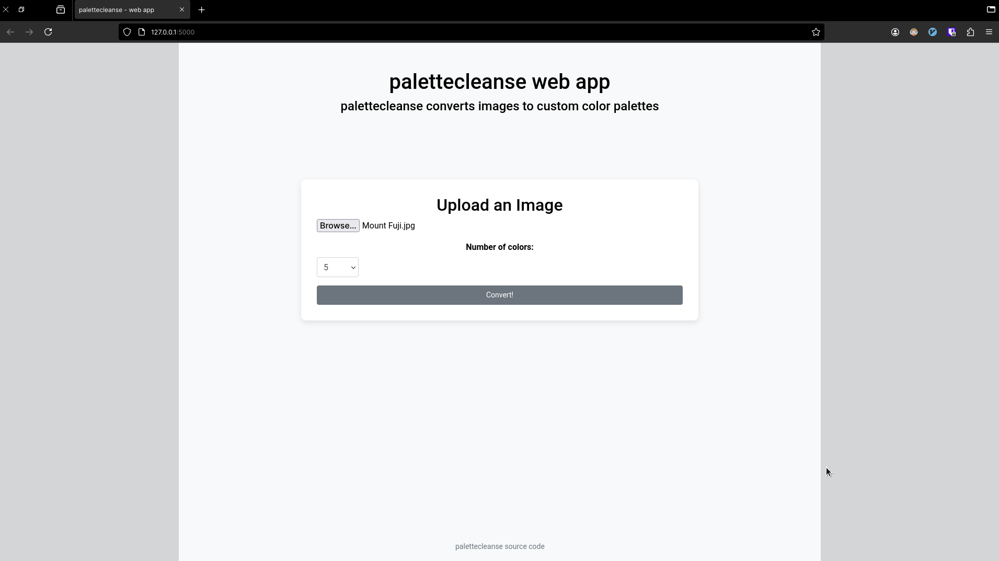
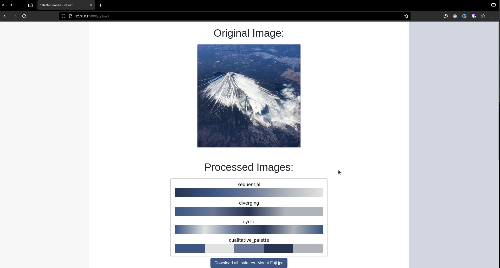
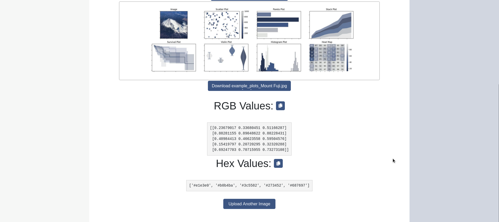

# palettecleanse webapp
Code for web app version of [`palettecleanse`](https://github.com/sansona/palettecleanse)

## Contributing
Contributions at all levels are welcome! I'm happy to discuss with anyone the potential for contributions. Please see [`CONTRIBUTING.md`](https://github.com/sansona/palettecleanse/blob/main/CONTRIBUTING.md) in the main `palettecleanse` library for some general guidelines and message me with any questions!

## Meta
Jiaming Chen –  jiaming.justin.chen@gmail.com